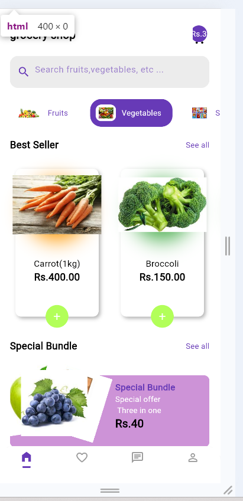
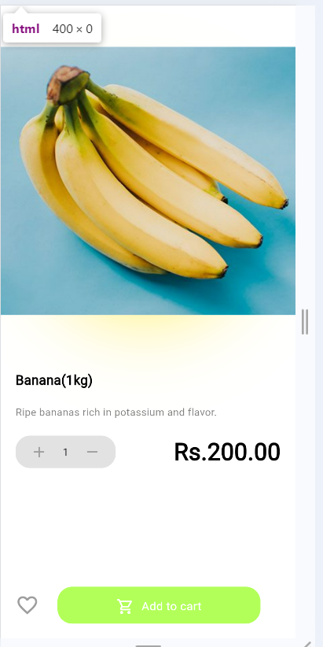
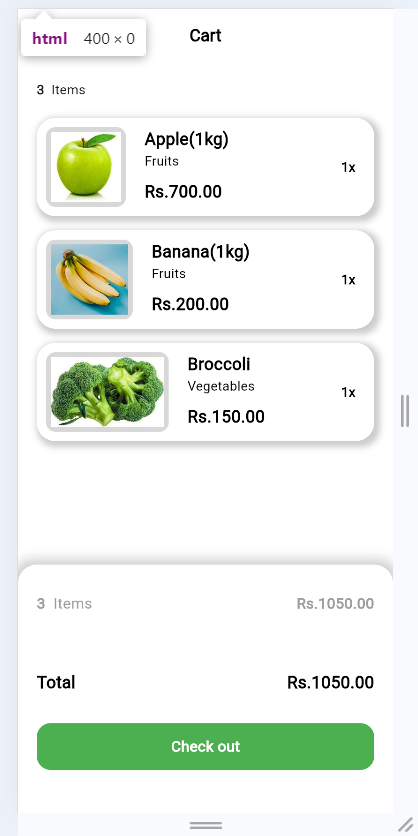
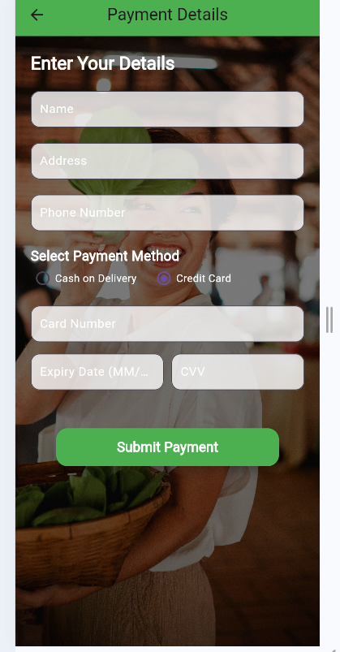

# Grocery Shop App

This is a Flutter-based app for browsing and purchasing groceries. Users can view various categories of grocery items, add them to their cart, and complete the purchase seamlessly.

## Features

- Browse different grocery categories (fruits, vegetables, dairy, snacks, etc.).
- Add items to the shopping cart.
- View product details and prices.
- Complete purchases through a simple checkout process.
- User-friendly interface with smooth navigation.

## Installation

1. Clone the repository.
2. Run `flutter pub get` to install dependencies.
3. Run the app with `flutter run`.

## Preview

